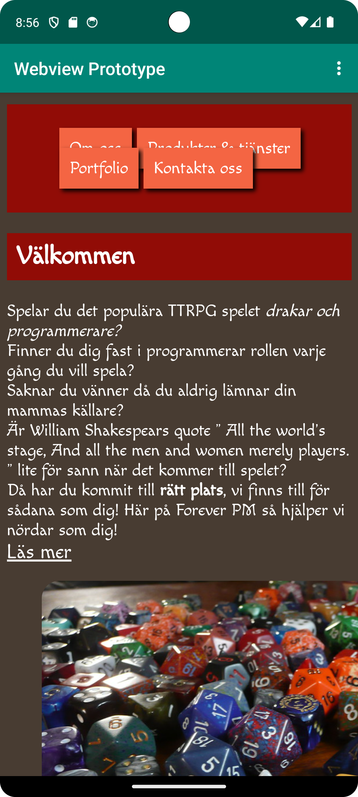
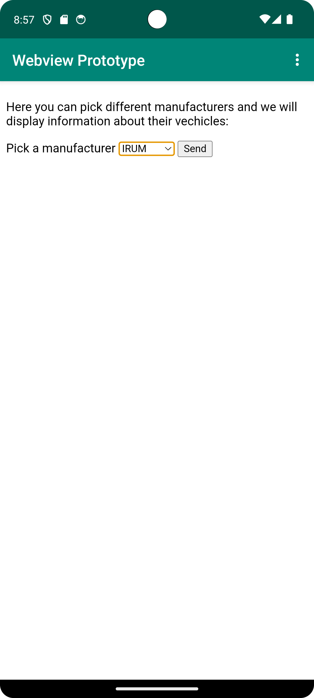

# Rapport
I onCreate finner vi under de sista fyra raderna kod som lagts till, först har vi findViewByID för 
att hitta/referera till det id som skapats i en Webview under activity_main.xml. 
Därefter skapas en ny webbklient som kan hantera detta i applikationen med hjälp av setWebWievClient.
Därefter aktiveras Java funktioner för webbklienten med setJavascriptEnabled(true).
Till sist så importeras en URL som används i standard läget när man använder sig av appen. 

Under detta har vi ett exempel på hur WebView elementet ser ut med sitt skapade ID som finns
under activity_main.xml. Id:et skapas med hjälp av 'android:id="@+id/my_webview"'.


```
    @Override
    protected void onCreate(Bundle savedInstanceState) {
        super.onCreate(savedInstanceState);
        setContentView(R.layout.activity_main);
        Toolbar toolbar = findViewById(R.id.toolbar);
        setSupportActionBar(toolbar);
        myWebView = findViewById(R.id.my_webview);
        myWebView.setWebViewClient(new WebViewClient());
        myWebView.getSettings().setJavaScriptEnabled(true);
        myWebView.loadUrl("https://www.his.se/");
    }
    
        <WebView
        android:id="@+id/my_webview"
        android:layout_width="match_parent"
        android:layout_height="match_parent"
      />
```




